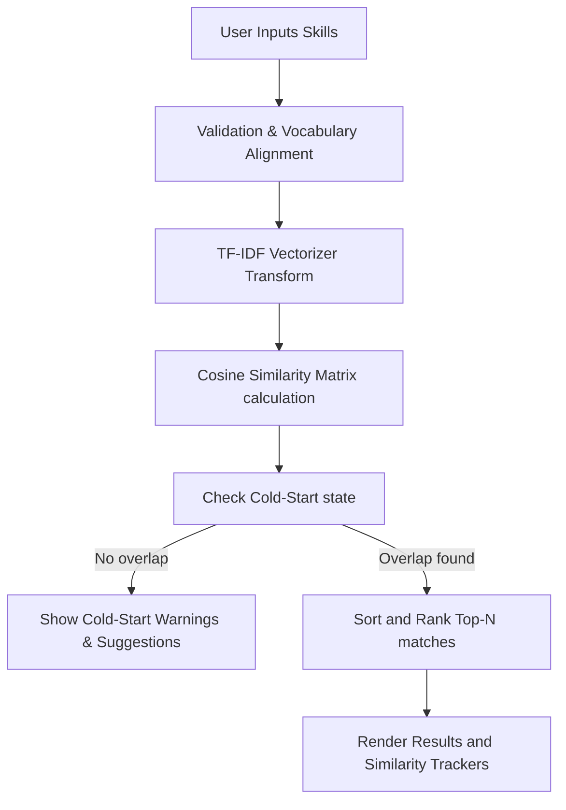

# SkillMatch — AI-Powered Tech Stack Recommender

SkillMatch is a production-ready, content-based recommendation engine built to align a user's technical skills with 20 professional tech roles. Instead of basic binary or Jaccard tag matching, the system implements continuous vector space modeling with TF-IDF representation and Cosine Similarity.

The project features a clean, responsive **light-theme web interface** built with Flask, raw CSS, and vanilla JavaScript.

---

## 🚀 Key Features

* **Continuous Vector Space Modeling**: Outperforms binary tag matching by modeling term importance via TF-IDF (Term Frequency-Inverse Document Frequency) vectorization.
* **L2-Normalized Cosine Similarity**: Compares the user skill profile vector with job role skill vectors in a high-dimensional space.
* **Cold-Start Handling**: Gracefully detects when input skills share zero overlap with the corpus vocabulary and offers smart prompts to recover.
* **Interactive Autocomplete**: Suggests vocabulary terms directly from the corpus in real-time.
* **Quick Presets**: Load pre-defined profiles (e.g., DevOps/Cloud, AI/ML, Frontend) to instantly test the recommender.
* **Dataset Explorer**: Expandable viewer to audit all 20 job roles and their corresponding skill profiles.

---

## 🛠️ Architecture Overview

The system is structured using the **Input-Process-Output (IPO)** design pattern:



* **Data Ingestion**: Processes a local `raw_skills.csv` dataset.
* **Processing**: Leverages `scikit-learn`'s `TfidfVectorizer` and `cosine_similarity`.
* **Delivery**: Exposes high-performance REST APIs wrapped in a responsive Flask server.

---

## 📦 Installation & Setup

Ensure you have Python 3.8+ installed.

1. **Clone the Repository**:
   ```bash
   git clone <repository_url>
   cd task3
   ```

2. **Set up a Virtual Environment**:
   ```bash
   python -m venv venv
   # On Windows:
   venv\Scripts\activate
   # On macOS/Linux:
   source venv/bin/activate
   ```

3. **Install Dependencies**:
   ```bash
   pip install -r requirements.txt
   ```

4. **Run the Application**:
   ```bash
   # On Windows:
   set PYTHONUTF8=1
   python app.py
   
   # On macOS/Linux:
   PYTHONUTF8=1 python app.py
   ```

5. **Access the App**:
   Open [http://127.0.0.1:5000](http://127.0.0.1:5000) in your web browser.

---

## 📊 Dataset Profile

The engine evaluates matches against 20 key roles, including:
* *Machine Learning Engineer*, *DevOps Engineer*, *Data Scientist*, *Frontend Developer*, *Backend Developer*, *Full Stack Developer*, *Security Architect*, *Database Administrator*, *Robotics Engineer*, *Cloud Architect*, and more.

## Screenshots


